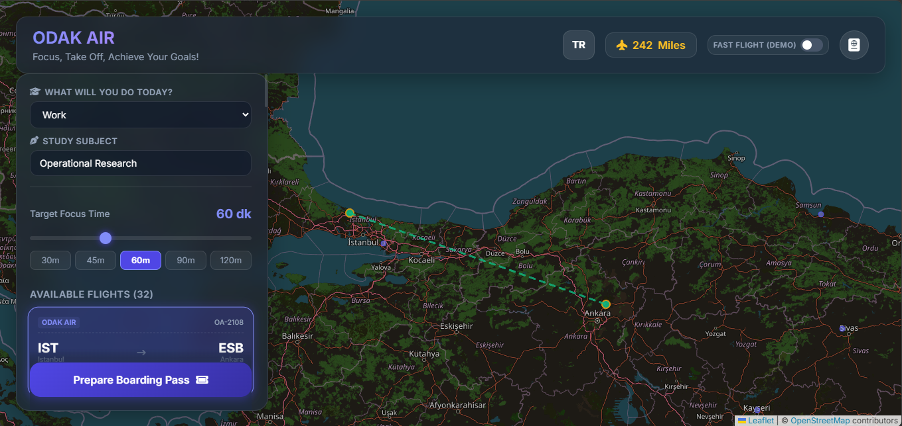

# ✈️ ODAK AIR — Gamified Focus Platform

**ODAK AIR** is a desktop web application that transforms focused study sessions into simulated domestic flights across Turkey.

Instead of using a traditional countdown timer, users select a focus duration and a study goal, choose a simulated flight route, receive a boarding pass, and begin their focus session as a flight.

The experience combines **productivity, gamification, interactive maps, simulated flight telemetry, and progress tracking** into a single interface.

---

## 📸 Interface Preview

---

## 💡 Concept

ODAK AIR was designed around a simple idea:

> **What if focusing on a task felt like taking a flight toward a destination?**

Users choose a study category, enter their subject, and select a target focus duration between **30 and 120 minutes**.

The application then filters simulated flight routes that match the selected duration.

Once a flight is selected, the user receives a boarding pass and starts the focus session.

During the flight, the interface displays:

- Focus countdown
- Study progress
- Interactive flight route
- Simulated aircraft movement
- Flight phase
- Altitude
- Ground speed
- Outside temperature
- Remaining distance
- Personal checklist

After completing the session, the user earns miles and unlocks the destination in their pilot passport.

---

## ✨ Key Features

### ✈️ Flight-Based Focus Sessions

Focus durations are represented as simulated domestic flights.

Users can select routes based on their desired focus duration and begin a session through a boarding-pass interface.

### 🗺️ Interactive Flight Map

The application uses **Leaflet.js** and OpenStreetMap tiles to visualize flight routes across Turkey.

The aircraft marker moves along the selected route and dynamically rotates toward the destination.

### 🧭 Simulated Flight Telemetry

The focus session is divided into three simulated flight phases:

- **Climb**
- **Cruise**
- **Descent**

Telemetry values such as altitude, ground speed, temperature, and remaining distance are calculated dynamically throughout the session.

### 📝 In-Flight Checklist

Users can create personal tasks for their focus session and mark them as completed while the flight is in progress.

### 🛂 Pilot Passport

Completed flights contribute to a personal passport-style progress log.

Users can:

- Earn miles
- Increase their pilot rank
- Unlock destination cities
- Collect city-specific stamps

### 🌍 Turkish / English Interface

The application includes a dynamic TR/EN localization system.

The interface, placeholders, labels, and study categories can be switched without reloading the page.

### ⚡ Demo Mode

A fast-flight demo mode allows the complete focus-flight experience to be demonstrated without waiting for the full session duration.

### 💾 Local Persistence

User progress such as earned miles and unlocked destinations is stored using browser `localStorage`.

---

## 🧩 Technical Architecture

ODAK AIR is built as a client-side web application with no backend.

### State Management

Application state is centralized in a `currentState` object that manages:

- Current flight
- Destination and departure
- Focus timer
- Checklist
- Flight progress
- Map markers
- Telemetry
- Language
- Session status

### Localization

The localization system uses:

- `data-i18n` attributes
- A centralized translation object
- Dynamic DOM updates
- Localized study categories

### Flight Simulation

Flight routes are represented using simulated flight data.

The application calculates:

- Route distance
- Aircraft position
- Heading
- Flight progress
- Remaining distance
- Simulated telemetry values

### Data Persistence

`localStorage` is used to persist user progress between browser sessions.

Storage operations are wrapped with defensive `try/catch` handling.

---

## 🛠️ Tech Stack

| Technology | Purpose |
|------------|---------|
| **HTML5** | Application structure and semantic markup |
| **CSS3** | Layout, styling, animations and glassmorphism UI |
| **Vanilla JavaScript (ES6+)** | Application logic, state management and simulation |
| **Leaflet.js** | Interactive map and route visualization |
| **OpenStreetMap** | Map tiles |
| **Font Awesome** | Interface icons |
| **Google Fonts (Inter)** | Typography |
| **localStorage** | Client-side progress persistence |

---

## 🚀 Running the Project

No backend or build process is required.

### Option 1 — Open locally

1. Clone the repository.
2. Open `index.html` in a modern web browser.
3. Start planning a focus flight.

### Option 2 — GitHub Pages

The project can also be deployed as a static website using GitHub Pages.

---

## 🎮 How It Works

Choose Study Goal  
↓  
Choose Focus Duration  
↓  
Select Simulated Flight  
↓  
Generate Boarding Pass  
↓  
Take Off  
↓  
Focus Session  
↓  
Complete Checklist  
↓  
Touchdown  
↓  
Earn Miles  
↓  
Unlock Destination  
↓  
Update Pilot Passport

---

## 📌 Notes

- Flight routes and flight data are **simulated for demonstration purposes**.
- Telemetry values are also simulated and are not intended to represent real-time aviation data.
- User progress is stored locally in the browser and is not synchronized across devices.
- The application is designed as a desktop-first web experience.

---

## 🔮 Possible Future Improvements

Potential future iterations could include:

- Real-time flight data integration
- User accounts and cloud-based progress synchronization
- More destinations and international routes
- Additional gamification mechanics
- Focus session statistics and analytics
- Achievement and milestone systems

---

## 👩‍💻 About the Project

ODAK AIR was developed as a personal project exploring the intersection of **productivity, gamification, interface design, and interactive web development**.

The project focuses on turning a familiar productivity tool into a more engaging and immersive user experience.
